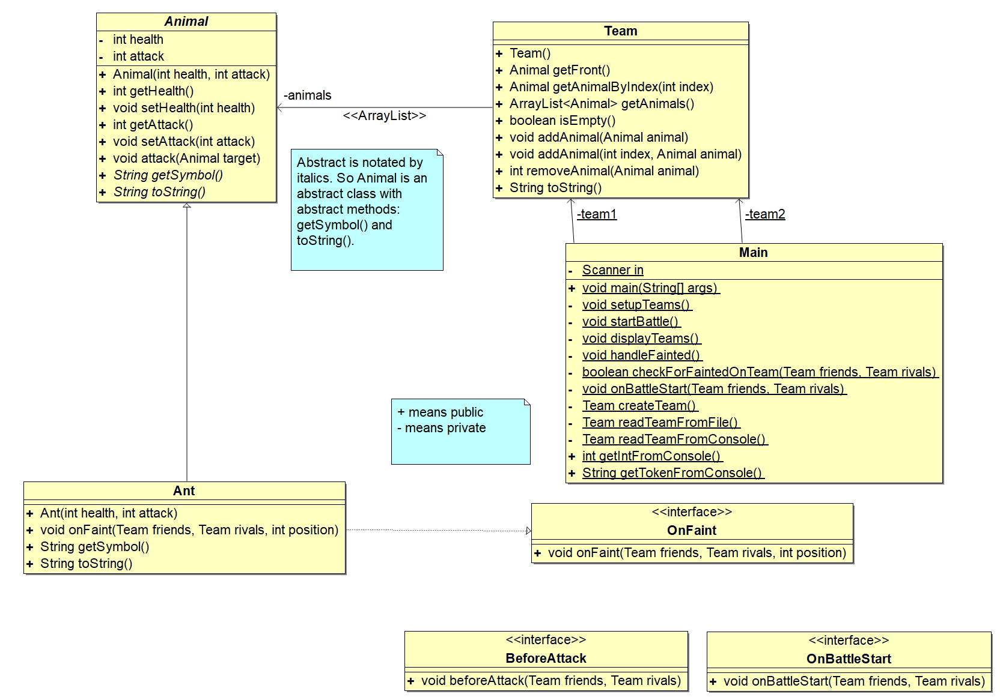

# Interfaces & Abstract Classes

## UML Diagram

## Problem Statement

You are given the `Main.java`, `Team.java`, and `Ant.java`.

Based on the given UML diagram complete the implementation of all other necessary files. `Ant.java` should give you an idea of how to implement a new Animal. After you finish implementing your program, and testing it with just Ants, add some more Animal classes by using the given interfaces.

The program might not always be user proofed how you expect, but it shouldn't crash on you ㄟ( ▔, ▔ )ㄏ

## Step 1

Implement `Animal.java`, `OnBattleStart.java`, `OnFaint.java`, `BeforeAttack.java`.

## Step 2

Test thoroughly using teams consiting of Ants, does everything work as expected? does it still compile?

## Step 3

Add 4 more animals of your own. These should be in their own `.java` files.

Some ideas would be:

- Boar: Gain (+2, +2) before attacking
- Mosquito: Damage a random rival at the start of the battle
- Hedgehog: Damage all pets when it faints
- Mammoth: Give all friends (+2, +2) on faint
- Anything else you can come up with, some ideas might break the game a bit. But have fun with it.
